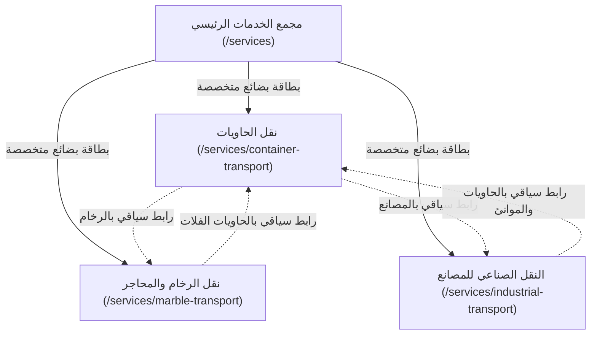

# خطة التنفيذ النهائية للـ SEO للموقع العام (SEO Final Implementation Plan)
### مشروع: SAMA Logistics (`sama-corser`)
**المرجع:** مخرجات التدقيق الفعلي لصفحات الخدمات والميتاداتا (المرحلة الثالثة — READ ONLY).  
**الحالة:** تدقيق وتحليل وتوثيق معماري بانتظار الاعتماد الصريح (Scope Review & Approval Required).  
**تاريخ التحديث:** 16 سبتمبر 2026  

---

## الفهرس العام
1. [التدقيق الفني الشامل لكل صفحة خدمة (Per-Page Technical Audit)](#1-التدقيق-الفني-الشامل-لكل-صفحة-خدمة-per-page-technical-audit)
2. [التحليل العميق لتضارب الكلمات المفتاحية (Cannibalization Analysis)](#2-التحليل-العميق-لتضارب-الكلمات-المفتاحية-cannibalization-analysis)
3. [الحلول المقترحة والمقارنة قبل وبعد (Proposed Solutions Table)](#3-الحلول-المقترحة-والمقارنة-قبل-وبعد-proposed-solutions-table)
4. [هندسة الربط الداخلي بين مجمع الخدمات وصفحات الهبوط (Internal Linking Architecture)](#4-هندسة-الربط-الداخلي-بين-مجمع-الخدمات-وصفحات-الهبوط-internal-linking-architecture)
5. [بروتوكول السلامة والحدود الصارمة (Strict Safety Invariants)](#5-بروتوكول-السلامة-والحدود-الصارمة-strict-safety-invariants)

---

## 1. التدقيق الفني الشامل لكل صفحة خدمة (Per-Page Technical Audit)

### أ. صفحة مجمع الخدمات الرئيسي (`/services`)
* **الرابط (URL):** `https://samalogistics.com/services`
* **العنوان الحالي (Title):**
  - عربي: `خدمات النقل اللوجستي ونقل الحاويات في بورسعيد`
  - إنجليزي: `Freight, Customs & Transport Services in Port Said`
* **الوصف الحالي (Meta Description):**
  - عربي: `خدمات احترافية في نقل الحاويات والشحن والتخليص الجمركي في بورسعيد. حلول لوجستية سريعة وآمنة وموثوقة من شركة سما لوجيستك.`
  - إنجليزي: `Sea freight, land transport, customs clearance, warehousing, and cargo insurance from Port Said, Egypt. Explore SAMA Logistics services.`
* **العنوان المرئي الرئيسي (Current H1):**
  - عربي: `خدماتنا اللوجستية` (أو ما يتم جلبه ديناميكياً من CMS).
  - إنجليزي: `Our Logistics Services`
* **أبرز عناوين H2 و H3 في الصفحة:**
  - H2: `خدماتنا المتخصصة` / `Our Specialized Services` (بطاقات البضائع المتخصصة)
  - H2: `أسطولنا الحديث` / `Our Modern Fleet`
  - H2: `الموانئ ومحطات العمليات` / `Ports & Operational Hubs`
  - H2: `احسب تكلفة شحنتك` / `Calculate Your Shipment Cost`
  - H3: بطاقات الخدمات الفردية الست (الشحن البحري، الجوي، البري، التخليص، التخزين، التأمين).
  - H3: بطاقات البضائع (نقل الرخام، نقل الحاويات، النقل الصناعي، المواد الحساسة، الصب، المواد الخطرة).
* **الكلمات المفتاحية والمواضيع المرئية البارزة:**
  - خدمات الشحن، النقل الدولي والبري، التخليص الجمركي، المستودعات، الأسطول، موانئ مصر (بورسعيد، دمياط، الإسكندرية، العين السخنة)، أنواع البضائع المتخصصة.
* **الهدف والنية البحثية (Search Intent):**
  - **نية استكشافية وتجارية عامة (Broad Commercial / Navigational Hub):** التعرف على كافة الحلول اللوجستية لشركة سما لوجستيك والانتقال منها إلى الخدمات التفصيلية.
* **الروابط الداخلية المتجهة للصفحة (Inbound Links):**
  - القائمة العلوية الرئيسية (Navbar) في كامل الموقع (`/services`).
  - الفوتر في كامل الموقع.
  - فتات الخبز (Breadcrumbs) في كافة صفحات الخدمات الفرعية.
  - أزرار الدعوة للإجراء في الصفحة الرئيسية ومن نحن.
* **الروابط الداخلية الصادرة من الصفحة (Outbound Links):**
  - روابط صفحات الهبوط المتخصصة الثلاث: `/services/container-transport`, `/services/marble-transport`, `/services/industrial-transport`.
  - روابط صفحات الخدمات الست الديناميكية: `/services/sea-freight`, `/services/customs-clearance`, إلخ.
  - أزرار طلب عروض الأسعار: `/contact?tab=quote`.
* **الرابط الكانونيكال (Canonical):** `https://samalogistics.com/services`
* **البيانات المنظمة (Structured Data):** ترث سكيما `WebSite` و `Organization` من الـ Root Layout.
* **قابلية الفهرسة (Indexability):** مفهرسة بالكامل (`index, follow`).

---

### ب. صفحة نقل الحاويات المتخصصة (`/services/container-transport`)
* **الرابط (URL):** `https://samalogistics.com/services/container-transport`
* **العنوان الحالي (Title):**
  - عربي: `نقل حاويات بورسعيد — شحن كامل ومشترك FCL & LCL | سما لوجيستك`
  - إنجليزي: `Container Transport in Port Said — FCL & LCL Shipping | SAMA Logistics`
* **الوصف الحالي (Meta Description):**
  - عربي: `نقل حاويات احترافي من بورسعيد. شحن كامل ومشترك، تخليص جمركي، نقل رخام وبضائع ثقيلة. خبرة 25+ سنة، أكثر من 10,000 حاوية سنوياً. عرض سعر خلال ساعة.`
  - إنجليزي: `Professional container transport from Port Said. FCL & LCL shipping, customs clearance, marble & heavy cargo transport. 25+ years, 10,000+ containers yearly. Get a quote within 1 hour.`
* **العنوان المرئي الرئيسي (Current H1):**
  - عربي: `حاوياتك تصل في الموعد — بدون خسائر`
  - إنجليزي: `Your Containers Arrive On Time — Zero Losses`
* **أبرز عناوين H2 و H3 في الصفحة:**
  - H2: `لماذا تختار سما لنقل الحاويات؟` / `Why SAMA for Container Transport?`
  - H2: `أنواع الحاويات والخدمات المتاحة` / `Container Types & Available Services`
  - H2: `الأسئلة الشائعة حول نقل الحاويات` / `Frequently Asked Questions`
  - H2: `ابدأ شحن حاوياتك — بدون تأخير، بدون مفاجآت` / `Start Shipping Your Containers`
  - H3: حلول المشكلات: `تأخير الميناء`, `تلف البضائع`, `رسوم غير متوقعة`, `صعوبة التتبع`.
  - H3: خيارات الشحن: `حاويات كاملة FCL`, `حمولات مشتركة LCL`, `حاويات خاصة (فلات راك / مفتوحة السقف)`, `تخليص جمركي وعمليات موانئ`.
* **الكلمات المفتاحية والمواضيع المرئية البارزة:**
  - نقل حاويات بورسعيد، شحن FCL، شحن LCL، رسوم الأرضيات، تأخير الموانئ، محطة الحاويات شرق بورسعيد SCCT، ميناء دمياط، بضائع ثقيلة، flat-rack.
* **الهدف والنية البحثية (Search Intent):**
  - **نية تحويلية وتجارية متخصصة (High-Intent Transactional Landing Page):** استقطاب العملاء الباحثين مباشرة عن شحن ونقل الحاويات وعروض أسعار نقل الحاويات في مصر.
* **الروابط الداخلية المتجهة للصفحة (Inbound Links):**
  - الفوتر الدائم (`/services/container-transport`).
  - واجهة بطاقات مجمع الخدمات (`/services`).
  - البطاقة البارزة في الصفحة الرئيسية (Home Hero).
* **الروابط الداخلية الصادرة من الصفحة (Outbound Links):**
  - فتات الخبز: `/` و `/services`.
  - أزرار الدعوة للتحويل: `/contact?tab=quote`.
* **الرابط الكانونيكال (Canonical):** `https://samalogistics.com/services/container-transport`
* **البيانات المنظمة (Structured Data):**
  - `Service` schema (مع مزود `LocalBusiness` بالبيانات الرسمية والرمز البريدي المعتمد `8571011` وإحداثيات `31.2509721, 32.2930159`).
  - `BreadcrumbList` schema (3 مستويات).
  - `FAQPage` schema (6 أسئلة وأجوبة تخصصية).
* **قابلية الفهرسة (Indexability):** مفهرسة بالكامل (`index, follow`).

---

### ج. صفحة نقل الرخام والمحاجر (`/services/marble-transport`)
* **الرابط (URL):** `https://samalogistics.com/services/marble-transport`
* **العنوان الحالي (Title):**
  - عربي: `نقل الرخام والمواد المحجرية والتعدينية | سما لوجيستك`
  - إنجليزي: `Marble, Quarry & Mining Transport | SAMA Logistics`
* **الوصف الحالي (Meta Description):**
  - عربي: `نقل الرخام والجرانيت والمواد المحجرية والتعدينية بأمان وكفاءة تشغيلية عالية من مواقع الإنتاج مثل شق الثعبان إلى مواقع العمل. أسطول متخصص للأحمال الثقيلة حتى 60 طن.`
  - إنجليزي: `Safe and efficient marble, granite, quarry, and mining materials transport from production sites like Shaq El-Tue'ban to worksites. Specialized heavy-load fleet up to 60 tons.`
* **العنوان المرئي الرئيسي (Current H1):**
  - عربي: `نقل الرخام والمواد المحجرية والتعدينية بأعلى درجات الأمان`
  - إنجليزي: `Marble, Quarry & Mining Transport — Maximum Safety`
* **أبرز عناوين H2 و H3 في الصفحة:**
  - H2: `تحديات نقل الرخام والمحاجر وكيف نحلها`
  - H2: `مواصفات أسطول نقل الرخام والأحمال الثقيلة` (حمولة 60 طن، تريلات فلات)
  - H2: `الأسئلة الشائعة حول نقل الرخام`
  - H2: CTA النهائي لطلب عروض الأسعار.
* **الكلمات المفتاحية والمواضيع المرئية البارزة:**
  - نقل رخام، نقل جرانيت، شق الثعبان، محاجر، تريلات أحمال ثقيلة، تأمين الكسر، تصاريح طرق.
* **الهدف والنية البحثية (Search Intent):**
  - **نية تجارية تخصصية B2B (Specialized Commercial):** استهداف أصحاب المصانع والمقاولين الباحثين عن نقل كتل وألواح الرخام والمواد الخام.
* **الروابط الداخلية المتجهة للصفحة:** الفوتر، وبطاقة البضائع بمجمع الخدمات `/services`.
* **الروابط الداخلية الصادرة:** فتات الخبز، وروابط `/contact?tab=quote`.
* **الرابط الكانونيكال:** `https://samalogistics.com/services/marble-transport`
* **البيانات المنظمة:** `Service` (مع LocalBusiness المعتمد `8571011`)، `BreadcrumbList`، `FAQPage`.
* **قابلية الفهرسة:** مفهرسة بالكامل (`index, follow`).

---

### د. صفحة نقل حاويات المصانع والقطاع الصناعي (`/services/industrial-transport`)
* **الرابط (URL):** `https://samalogistics.com/services/industrial-transport`
* **العنوان الحالي (Title):**
  - عربي: `نقل حاويات المصانع والقطاع الصناعي | سما لوجيستك`
  - إنجليزي: `Factory & Industrial Container Transport | SAMA Logistics`
* **الوصف الحالي (Meta Description):**
  - عربي: `نقل حاويات 40 قدم والبضائع الصناعية من وإلى المصانع والمجمعات الصناعية في جميع المحافظات. أسطول مخصص، التزام بالمواعيد، تغطية شاملة للعاشر و6 أكتوبر والسادات وجميع المناطق الصناعية.`
  - إنجليزي: `Professional 40ft container and industrial cargo transport to and from factories and industrial zones across all governorates...`
* **العنوان المرئي الرئيسي (Current H1):**
  - عربي: `نقل حاويات المصانع في جميع المناطق الصناعية`
  - إنجليزي: `Factory Container Transport Across All Industrial Zones`
* **أبرز عناوين H2 و H3 في الصفحة:**
  - H2: `تحديات النقل الصناعي للمصانع`
  - H2: `المناطق الصناعية المشمولة بالتغطية` (العاشر من رمضان، 6 أكتوبر، السادات، برج العرب، بورسعيد الصناعية)
  - H2: `الأسئلة الشائعة حول النقل الصناعي`
* **الكلمات المفتاحية والمواضيع المرئية البارزة:**
  - نقل حاويات 40 قدم للمصانع، عقود تشغيل منتظمة، خطوط إنتاج، مناطق صناعية، بضائع ومعدات صناعية.
* **الهدف والنية البحثية (Search Intent):**
  - **نية تجارية B2B للشركات والمصانع (Corporate Industrial Logistics).**
* **الروابط الداخلية المتجهة للصفحة:** الفوتر، وبطاقة البضائع بمجمع الخدمات `/services`.
* **الروابط الداخلية الصادرة:** فتات الخبز، وروابط `/contact?tab=quote`.
* **الرابط الكانونيكال:** `https://samalogistics.com/services/industrial-transport`
* **البيانات المنظمة:** `Service`، `BreadcrumbList`، `FAQPage`.
* **قابلية الفهرسة:** مفهرسة بالكامل (`index, follow`).

---

### هـ. صفحات الخدمات الديناميكية الأساسية (`/services/[slug]`)
*(مثل `/services/sea-freight` و `/services/customs-clearance`)*
* **الروابط (URLs):**
  - `https://samalogistics.com/services/sea-freight`
  - `https://samalogistics.com/services/customs-clearance`
* **العنوان الحالي (Title):** اسم الخدمة المباشر (مثل `شحن بحري | Sea Freight` أو `تخليص جمركى | Customs Clearance`).
* **الوصف الحالي (Meta Description):** الوصف المسجل للخدمة من جدول `Service`.
* **العنوان المرئي الرئيسي (Current H1):** اسم الخدمة بخط عريض أعلى القسم المرئي (`<h1>{service.titleAr}</h1>`).
* **أبرز عناوين H2:** `المميزات الرئيسية` / `Key Features`، `تفاصيل الخدمة` / `Service Details`.
* **الهدف والنية البحثية:** صفحات تعريفية متخصصة بكل خدمة لوجستية مستقلة.
* **الروابط الداخلية:** متصلة بالفوتر (للشحن والتخليص) وبمجمع الخدمات `/services` وفتات الخبز.
* **الكانونيكال:** `https://samalogistics.com/services/[slug]`
* **قابلية الفهرسة:** مفهرسة بالكامل (`index, follow`).

---

## 2. التحليل العميق لتضارب الكلمات المفتاحية (Cannibalization Analysis)

### المقارنة الدقيقة: `/services` مقابل `/services/container-transport`

#### 1. هل مشاركة الكلمات العامة (Logistics, Shipping, Port Said, Egypt) تُعد تضارباً؟
**قطعاً لا.** إن وجود كلمات مثل "بورسعيد"، "مصر"، "لوجستيك"، "شحن" في كلا الصفحتين أمر طبيعي وضروري لتعريف الهوية الجغرافية والنشاط التجاري للشركة. جوجل لا يعاقب على الكلمات الوصفية العامة المشتركة.

#### 2. أين يقع التضارب الحقيقي الفعلي؟
يقع التضارب الحقيقي فقط في **حزمة الكلمات المفتاحية المركبة (Keyword Cluster Overlap) في الميتاداتا العربية لصفحة `/services`**:
* في `app/services/page.tsx`:
  - وسْم العنوان (`<title>`): `"خدمات النقل اللوجستي ونقل الحاويات في بورسعيد"`
  - وسْم الوصف (`<meta description>`): `"خدمات احترافية في نقل الحاويات والشحن والتخليص الجمركي في بورسعيد..."`
  - وسْم الكلمات المفتاحية: `"نقل حاويات مصر, شركة لوجستية بورسعيد..."`
* في المقابل، صفحة `container-transport`:
  - وسْم العنوان (`<title>`): `"نقل حاويات بورسعيد — شحن كامل ومشترك FCL & LCL | سما لوجيستك"`
  - وسْم الوصف (`<meta description>`): `"نقل حاويات احترافي من بورسعيد..."`

#### 3. التداخل الحقيقي في النية البحثية (Search Intent Collision):
* عندما يبحث مستخدم عن: **"نقل حاويات بورسعيد"** أو **"نقل حاويات مصر"**:
  - يتنافس عنوان صفحة `/services` مباشرة مع صفحة `/services/container-transport` على نفس العبارة تماماً.
  - ترتبك روبوتات البحث وتعتبر أن الموقع لديه صفحتان تتنافسان على نفس الكلمة المفتاحية المحددة، مما يؤدي إلى تشتيت قوة النطاق وإظهار نتائج متأخرة لكليهما.
* وفي الوقت نفسه، عندما يبحث مستخدم عن: **"خدمات لوجستية في مصر"** أو **"شركات الشحن والخدمات اللوجستية ببورسعيد"**:
  - تعجز صفحة `/services` عن المنافسة القوية لأن عنوانها حصر نفسه في "نقل الحاويات" بدلاً من إبراز الخدمات اللوجستية الشاملة والمتكاملة (بحري، جوي، بري، تخليص، تخزين).

#### 4. حالة المحتوى المرئي الفعلي (Visual On-Page Content):
* **العنوان المرئي الرئيسي (H1) لصفحة `/services`:** هو `"خدماتنا اللوجستية"`، ومحتوى الصفحة يعرض بالفعل دليلاً شاملاً لكافة الخدمات، والأسطول، والموانئ. **المحتوى المرئي لصفحة `/services` بريء من التضارب**.
* **النتيجة:** التضارب تقني ومحصور بنسبة 100% في وسوم الـ SEO في ملف `app/services/page.tsx`.

---

## 3. الحلول المقترحة والمقارنة قبل وبعد (Proposed Solutions Table)

> [!IMPORTANT]
> **جميع الحلول التالية مقترحة للمراجعة فقط ولم يتم تطبيق أي سطر منها.**

| العنصر | الحالة الراهنة (Current) | المقترح الهندسي (Proposed) | سبب التعديل | هل هو مرئي للمستخدم؟ | درجة المخاطرة | العائد المتوقع للـ SEO |
|---|---|---|---|---|---|---|
| **H1 صفحة `/services`** | `خدماتنا اللوجستية` | **الإبقاء عليه كما هو دون أي تغيير** (`خدماتنا اللوجستية` / `Our Logistics Services`) | العنوان الحالي عام وشامل ويعبر بدقة عن مجمع الخدمات دون أي حشو. | نعم (مرئي) | منعدمة (Zero) | استقرار تجربة المستخدم والهيكل الحالي. |
| **Title صفحة `/services` (عربي)** | `خدمات النقل اللوجستي ونقل الحاويات في بورسعيد` | `خدمات الشحن والحلول اللوجستية المتكاملة في مصر \| سما لوجستيك` | إزالة عبارة "نقل الحاويات" من عنوان الدليل لإنهاء التضارب مع صفحة الحاويات وتوسيع الاستهداف. | لا (في الـ Head فقط) | منخفضة جداً (Low) | استهداف كلمات الشحن والحلول اللوجستية الشاملة ذات حجم البحث العالي. |
| **Title صفحة `/services` (إنجليزي)** | `Freight, Customs & Transport Services in Port Said` | `Integrated Freight & Logistics Solutions in Egypt \| SAMA Logistics` | مطابقة الهوية الشاملة للشركة وتعزيز الكلمات الدلالية الشاملة. | لا (في الـ Head فقط) | منخفضة جداً (Low) | تصدر نتائج البحث للشركات الأجنبية الباحثة عن وكيل لوجستي شامل بمصر. |
| **Meta Description لصفحة `/services` (عربي)** | `خدمات احترافية في نقل الحاويات والشحن والتخليص الجمركي في بورسعيد. حلول لوجستية سريعة وآمنة وموثوقة من شركة سما لوجيستك.` | `دليل خدمات شركة سما لوجستيك: الشحن البحري والجوي، النقل البري، التخليص الجمركي، التخزين وإدارة سلاسل الإمداد في مصر وموانئ بورسعيد ودمياط والإسكندرية.` | توضيح كافة أفرع الخدمات الست والموانئ، وتجنب حصر الوصف في الحاويات والتخليص. | لا (في الـ Head فقط) | منخفضة جداً (Low) | رفع نسبة النقر (CTR) لنتائج البحث العامة لمختلف أنواع الشحن. |
| **Meta Description لصفحة `/services` (إنجليزي)** | `Sea freight, land transport, customs clearance, warehousing, and cargo insurance from Port Said, Egypt. Explore SAMA Logistics services.` | `Comprehensive logistics services by SAMA Logistics: sea & air freight, land transportation, customs clearance, warehousing, and supply chain solutions across Egyptian ports.` | تحسين الصياغة التسويقية وإبراز حلول سلاسل الإمداد وتغطية الموانئ المصرية. | لا (في الـ Head فقط) | منخفضة جداً (Low) | جذب الاستفسارات الدولية للخدمات المتعددة الوسائط. |
| **H1 & Metadata لصفحة `container-transport`** | Title: `نقل حاويات بورسعيد — شحن كامل ومشترك FCL & LCL \| سما لوجيستك` H1: `حاوياتك تصل في الموعد — بدون خسائر` | **الإبقاء عليها كما هي دون أي مساس** | الصفحة مستهدفة ومحكمة بدقة لكلمات الحاويات FCL/LCL. وتعديل صفحة `/services` كافٍ تماماً لإطلاق قوتها الترتيبية. | نعم / لا | منعدمة (Zero) | تثبيت الصفحة كمرجع رئيسي وحيد لنقل الحاويات. |

---

## 4. هندسة الربط الداخلي بين مجمع الخدمات وصفحات الهبوط (Internal Linking Architecture)

لتحقيق أقصى ترابط سياقي (Topical Authority) دون إثقال الصفحات بنصوص زائدة، تم رصد الحد الأدنى الضروري من الروابط الداخلية لربط المجموعة العنقودية (Cluster):

### جدول التعديلات المقترحة للربط الداخلي (Minimum Required Contextual Links):

| م | الصفحة المصدر (File / Location) | الرابط الحالي | الوجهة المقترحة (Destination) | نص الرابط الظاهر المقترح (Anchor Text) | الغرض من الرابط (SEO Purpose) |
| :-: | :--- | :--- | :--- | :--- | :--- |
| **1** | `ContainerTransportClient.tsx` (بطاقة شحن الرخام بشق الثعبان) | نص عادي دون رابط (`من ألواح الرخام في شق الثعبان...`) | `/services/marble-transport` | `خدمات نقل الرخام والمحاجر بشق الثعبان` | توجيه الباحثين عن شحن الرخام لصفحة الرخام المخصصة، ونقل الـ Link Equity لتعزيز تخصص الصفحة. |
| **2** | `ContainerTransportClient.tsx` (قسم الحاويات الكاملة FCL للمصانع) | نص عادي دون رابط | `/services/industrial-transport` | `حلول نقل حاويات المصانع والمجمعات الصناعية` | ربط طلبات شحن المصانع بصفحة النقل الصناعي والعقود المنتظمة. |
| **3** | `MarbleTransportClient.tsx` (قسم تجهيزات التصدير والموانئ) | نص عادي دون رابط | `/services/container-transport` | `شحن وتصدير حاويات الرخام عبر الموانئ` | إغلاق الربط التبادلي (Reciprocal Cluster Link) لإثبات العلاقة بين الرخام وموانئ الحاويات. |
| **4** | `IndustrialTransportClient.tsx` (قسم شحن الحاويات من وإلى الموانئ) | نص عادي دون رابط | `/services/container-transport` | `خدمات نقل الحاويات من ميناء بورسعيد والموانئ المصرية` | ربط حركة نقل المصانع بمحطات الحاويات الرئيسية بالموانئ. |

---

## 5. بروتوكول السلامة والحدود الصارمة (Strict Safety Invariants)

نؤكد بالكامل أنه:
1. **الوضع الحالي:** قراءة وتدقيق فقط (READ-ONLY).
2. **الكود البرمجي:** لم يتم تعديل أي ملف في الكود المصدري للمشروع.
3. **قاعدة البيانات:** لم يتم تشغيل أي استعلام أو أمر قاعدة بيانات.
4. **المحتوى المرئي:** لم يتم تعديل أي عنوان مرئي H1 أو نصوص أو فقرات أو أزرار.
5. **المدونة:** مستبعدة تماماً من أي تدقيق أو مقترح.
6. **الخطوة التالية:** ننتظر مراجعتكم واعتمادكم الصريح لأي بند من الحلول والمقترحات أعلاه قبل البدء في تنفيذه.
